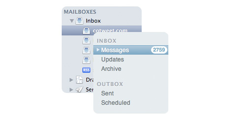

##5 User Interface Design Fundamentals
It’s no great mystery that truly great user interfaces are the ones that are engineered to stay out of the way.
>**Free trial on Treehouse**: Do you want to learn more about >web design? Click here to try a free 14-day trial on Treehouse.

*‘Staying out of the way’* means not distracting your users. Rather, good UIs let your users complete goals. The result? A reduction in training and support costs, and happier, satisfied and highly engaged users.

Check out our other design courses at Treehouse.

When getting started on a new interface, make sure to remember these fundamentals:
###1. Know your user
>“Obsess over customers: when given the choice between obsessing >over competitors or customers, always obsess over customers. >Start with customers and work backward.” – Jeff Bezos

Your user’s goals are your goals, so learn them. Restate them, repeat them. Then, learn about your user’s skills and experience, and what they need. Find out what interfaces they like and sit down and watch how they use them. Do not get carried away trying to keep up with the competition by mimicking trendy design styles or adding new features. By focusing on your user first, you will be able to create an interface that lets them achieve their goals.

###2. Pay attention to patterns

Users spend the majority of their time on interfaces other than your own (Facebook, MySpace, Blogger, Bank of America, school/university, news websites, etc). There is no need to reinvent the wheel. Those interfaces may solve some of the same problems that users perceive within the one you are creating. By using familiar UI patterns, you will help your users feel at home.

###3. Stay consistent

>“The more users’ expectations prove right, the more they will feel in control of the system and the more they will like it.” – >Jakob Nielson

Your users need consistency. They need to know that once they learn to do something, they will be able to do it again. Language, layout, and design are just a few interface elements that need consistency. A consistent interface enables your users to have a better understanding of how things will work, increasing their efficiency.

###4. Use visual hierarchy
>“Designers can create normalcy out of chaos; they can clearly communicate ideas through the organizing and manipulating of words and pictures.” – Jeffery Veen, The Art and Science of Web >Design

Design your interface in a way that allows the user to focus on what is most important. The size, color, and placement of each element work together, creating a clear path to understanding your interface. A clear hierarchy will go great lengths in reducing the appearance of complexity (even when the actions themselves are complex).

###5. Provide feedback
Your interface should at all times speak to your user, when his/her actions are both right and wrong or misunderstood. Always inform your users of actions, changes in state and errors, or exceptions that occur. Visual cues or simple messaging can show the user whether his or her actions have led to the expected result.

